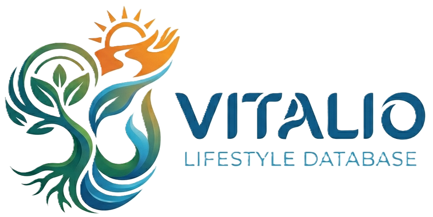

<p align="center">
  
</p>

<p align="center">
  An aggregator and search engine for video materials and podcasts about health, diet and lifestyle.<br>
  Hosted fully statically on <strong>GitHub Pages</strong>.
</p>

<p align="center">
  
  
  
</p>

<p align="center">
  <a href="README.md">Polski</a> · <strong>English</strong>
</p>

---

- [✨ About](#-about)
- [🚀 Features](#-features)
- [🗂️ Project structure](#️-project-structure)
- [📥 Contributing Guide](#-contributing-guide)
  - [🧩 Single entry schema](#-single-entry-schema)
  - [📋 Field reference](#-field-reference)
  - [🚀 How to submit a new material](#-how-to-submit-a-new-material)

---

## ✨ About

Vitalio is a lightweight database of videos and podcasts that can be filtered by **channel**, **person**, **tags**, **series** and **language**. It runs on a static architecture (JAMstack) — there is no backend or server-side database.

All content is stored as JSON files in the [`content/`](content/) directory. At build time the [`scripts/aggregate.js`](scripts/aggregate.js) script collects every entry into a single [`src/data.json`](src/data.json) file that powers the React app.

> 📁 **Content organization:** each file in `content/` corresponds to one YouTube channel, and its name is the channel name in `snake_case` (e.g. `tlusta_agata.json`). A single file contains an **array** of all materials from that channel.

---

## 🚀 Features

- 🌍 **Bilingual UI (PL / EN)** — flag toggle in the top-right corner; the choice is saved in `localStorage`. Only the interface is translated — material titles stay in their original language.
- 🏳️ **Filter by material language** — with flags (🇵🇱 / 🇬🇧) rendered as SVG, so they look identical on every platform. The flag on a card is clickable and instantly filters the list.
- 🌙 **Dark / light mode** — theme toggle; defaults to the system setting (`prefers-color-scheme`), the choice is saved in `localStorage`.
- 🔎 **Filters** — by tags, channel, person (guest), series and language; filters are reflected in the URL.
- ♾️ **Infinite scroll** — materials load as you scroll.

---

## 🗂️ Project structure

| Path | Description |
| --- | --- |
| [`content/`](content/) | Source JSON files — one file = one channel (array of materials). |
| [`scripts/aggregate.js`](scripts/aggregate.js) | Merges all files from `content/` into `src/data.json`. |
| [`src/data.json`](src/data.json) | Generated materials database (powers the app, is committed). |
| [`src/App.jsx`](src/App.jsx) | Main component — filter state, infinite scroll, layout. |
| [`src/components/FilterPanel.jsx`](src/components/FilterPanel.jsx) | Filter panel (tags + dropdowns). |
| [`src/components/VideoCard.jsx`](src/components/VideoCard.jsx) | Single material card. |
| [`src/components/Flag.jsx`](src/components/Flag.jsx) | Flags as SVG (PL / GB). |
| [`src/i18n.jsx`](src/i18n.jsx) | UI translation system (PL/EN). |
| [`src/theme.jsx`](src/theme.jsx) | Theme system (light/dark) + react-select styles. |
| [`src/languages.js`](src/languages.js) | Helpers for the `language` field (flag, language name). |

---

## 📥 Contributing Guide

The materials database is built automatically from the files in the `content/` directory and published weekly or more often. Below is how to add a new entry correctly.

### 🧩 Single entry schema

Every new material (video or podcast) must follow the object structure described in [`content/_example.txt`](content/_example.txt):

```json
{
  "id": "channel-name-1",
  "type": "video",
  "title": "Material title",
  "url": "https://www.youtube.com/watch?v=...",
  "language": "PL",
  "author": {
    "name": "Channel Name",
    "channelUrl": "https://www.youtube.com/@..."
  },
  "guests": ["First Last", "Guest 2"],
  "topics": ["topic1", "topic2"],
  "series": {
    "name": "Series Name",
    "order": 1
  }
}
```

### 📋 Field reference

| Field | Required | Description |
| --- | :---: | --- |
| `id` | ✅ | Unique identifier in the `channel-name-number` format (e.g. `tlusta-agata-1`). |
| `type` | ✅ | Material type — exactly `"video"` or `"podcast"`. |
| `title` | ✅ | Full title shown on the card. |
| `url` | ✅ | Full link to the material on YouTube. |
| `language` | ✅ | Material language — `"PL"` or `"EN"` (drives the flag and language filter). |
| `author.name` | ✅ | Channel name. |
| `author.channelUrl` | ✅ | Link to the author's channel. |
| `guests` | ⬜ | List of guests (array of strings; may be empty `[]`). |
| `topics` | ✅ | Tags/topics — lowercase, without the `#` sign. |
| `series` | ⬜ | An object `{ "name", "order" }` or `null` if the material is not part of any series. |

### 🚀 How to submit a new material

1. Add the entry to a JSON file named **after the channel** (`snake_case`) the material comes from. If a file for that channel does not exist yet — create it as an array with one object.
2. Create a separate branch and open a **pull request** to the `develop` branch.
3. At least once a week the changes will be published to the project's main branch.

If that is not possible, open a [new request](https://github.com/pablottolbap/vitalio/discussions/new?category=new-materials-request) and provide as much of the information required by the template as you can.

Report any bugs or suggestions in the project's [issues](https://github.com/pablottolbap/vitalio/issues), new features can be reported in [ideas](https://github.com/pablottolbap/vitalio/discussions/categories/ideas)

---

<p align="center">
  <sub>Documentation created and maintained by the project author. Last updated: May 2026.</sub>
</p>
